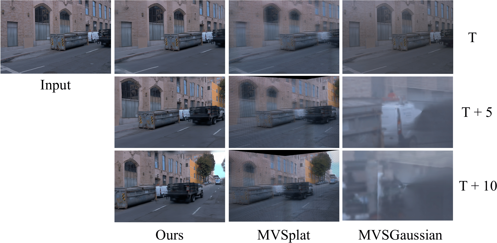
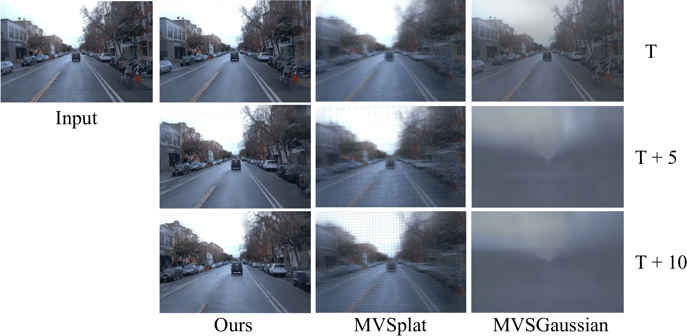
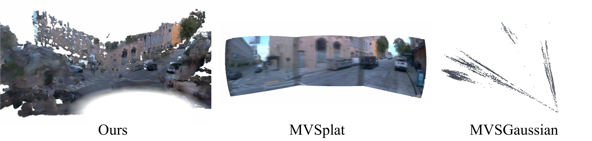

# SCube NeurIPS Rebuttal

## Qualitative Comparison with MVSplat & MVSGaussian

### Novel View Synthesis

### Visualization of 3D

Both MVSplat and MVSGaussian fail to model the true 3D geometry and the occluded parts of the scene and hence have unsatisfactory generalization capability to large-scale outdoor scenes.
Specifically, the geometry of MVSplat degenerates to a image plane, and the geometry of MVSGaussian contains too many outliers on the rays of the corresponding pixels.

